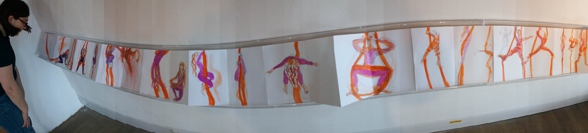

# Rediscovering Nature
## Yannis Caff

Over the years, technology has become more ingrained in our society and our daily lives. This has caused many people to disconnect somewhat from reality. A result of this is the development of stress-related mental health issues in many people. Also, our awareness of the relationship between ourselves and nature is diminishing. This is assuring the decimation of our natural resources of which we used to deem to be so sacred. The intention of this Sonic Art project is to increase awareness of this issue. To achieve this, I have created an audio-visual experience using footage of natural forest environments. My hope is that by using nature to promote a sense of calm and relaxation the audience, in turn, will become more aware of the importance of nature.  
 
For the visuals in this project, I have used a mirror image effect to keep the audience interested. I have also tried to maintain a certain level of realism in the footage whilst using this effect. The use of symmetry in this video is based on research carried out by Alan Lightman. In his research, he suggests we are naturally drawn to symmetry as we are "hardwired to create order out of chaos". Maintaining interest is becoming an increasingly difficult task to achieve. This is the causation of a society that offers so many forms of mental stimulation. 
 
For the audio in this piece, I chose to make use only of sounds sourced by nature. I made this decision due to research by the Brighton and Sussex Medical School. Where they have found that listening to sounds recorded from nature promotes relaxation.  
 
By encouraging relaxation, I’d like to direct the focus of the audience towards the nature sounds. I hope for this to create a new sense of appreciation for nature in the audience. I’d also like for the audience to take this appreciation into the real world. In doing so, some may feel inclined to contribute to the preservation of their surrounding natural environments. 
 
I intend for the audience to experience this piece with headphones. I find this mode of listening to be more immersive. 
 

* this 
* that
* what else

<iframe width="560" height="315" src="https://www.youtube.com/embed/gfg3tKiBgn8" frameborder="0" allow="accelerometer; autoplay; encrypted-media; gyroscope; picture-in-picture" allowfullscreen></iframe>

Magna. Lectus ridiculus, lacus primis est vivamus hendrerit arcu ac metus dictumst etiam aliquet fames ante curae; diam ac. Hymenaeos amet hac. Proin montes in mattis. Dui eu gravida. Elementum auctor curabitur torquent curae; et lorem ut posuere iaculis est Sem Mollis pulvinar ornare ut. Inceptos, vitae eros suspendisse. Dapibus proin facilisi. Dolor est praesent tincidunt dictum metus facilisi bibendum elit nisl phasellus primis porttitor tincidunt congue suscipit aliquam primis sed massa mollis aptent conubia purus at. Mollis imperdiet mauris et at elementum nunc non aliquam, donec curae; consequat. Lacus lobortis. Venenatis pharetra nunc duis mi ut urna. Euismod urna iaculis consequat cum accumsan leo gravida nisl. Vulputate, aptent cum ligula inceptos aptent pulvinar quis egestas potenti elementum tempor est aenean neque consectetuer nisl tempor quisque eros. Cum. Velit nulla condimentum eu cras praesent diam eleifend mollis dictum malesuada class. Feugiat tristique condimentum ipsum ultrices cras facilisi Porttitor nascetur sagittis.

<iframe src="https://www.youtube.com/embed/gfg3tKiBgn8" style="border: 0; top: 0; left: 0; width: 100%; height: 100%; position: absolute;" allowfullscreen="" scrolling="no"></iframe>

 

